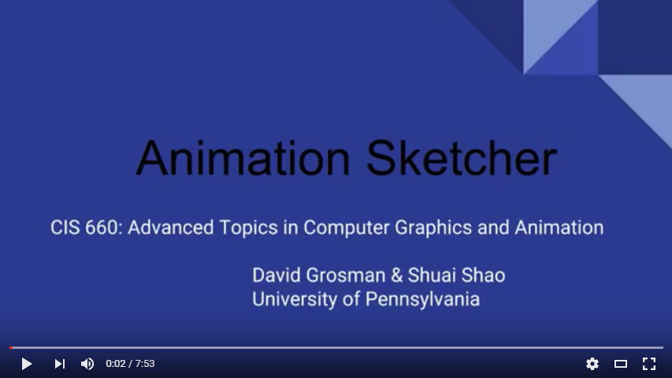
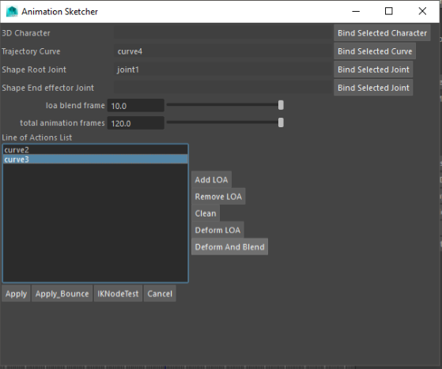
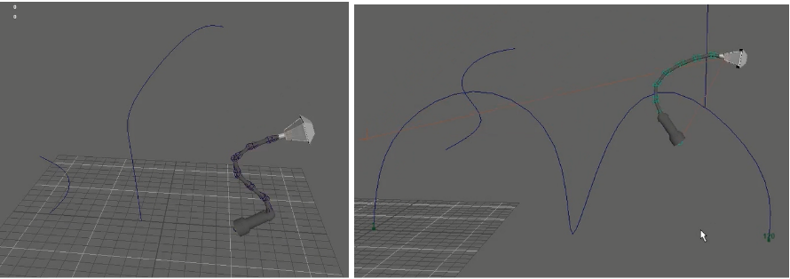
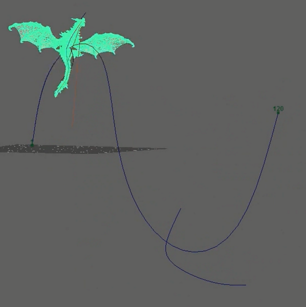

# Animation Sketcher

CIS 660 Authoring Tool Project

By David Grosman and Shuai Shao

Based on [*Space-time sketching of character animation*, Martin Guay, R´emi Ronfard, Michael Gleicher, Marie-Paule Cani, SIGGRAPH 2015](https://hal.archives-ouvertes.fr/hal-01153763/file/SpaceTimeSketching.pdf)

## Video

## Screen Shots

## Introduction

Our tool will free animators from nasty and repetitive key framing processes. With our tool, high quality animation with simple character morphologies can be generated given high concept trajectory and shape matching strokes. Additional shape matching curve can be added at any time to refine the original automatically generated animations. 

### Target Audience. 

From artists not experienced in key-frame animations to highly experienced CG animators. 
This tool only requires a minimum amount of knowledge of Maya. The user would just need to know how to draw a stroke and specify a model that will move according to that stroke. In general, it can be very useful to concept artists and 3D animators to speed-up the animation pipeline from a 2D Sketch of a model to a full 3D animation. It can also be used by designers to visualize the range of movement a character can perform. 

### User goals and objectives 

The users of this tool want to use a 2D trajectory space time curve and some shape strokes to generate a dynamic line of action (DLOA) that drives the motion of a 3D character. The shape of the 3D character will be matched to the shape strokes and its movement will be interpolated in a path following manner based on the trajectory curve. 

### Tool features and functionality

The user will draw a trajectory space time curve and some optional shape matching curve with the provided tool. Then they will select the 3d character that the animation is going to be applied to. 
A curve drawing tool (adapted from Maya) for drawing trajectory space time curve

A keyframe adjustment tool for tweaking the drawing speed at each point of the space time curve

A main menu for most of the parameter tweakings and configuration including curve selection, and 3D character selection and binding. 

### Tool input and output
* Input
    * 2D Trajectory space time curve
    * 2D shape of actions strokes
* Output
    * Key-framed animation of 3D character
